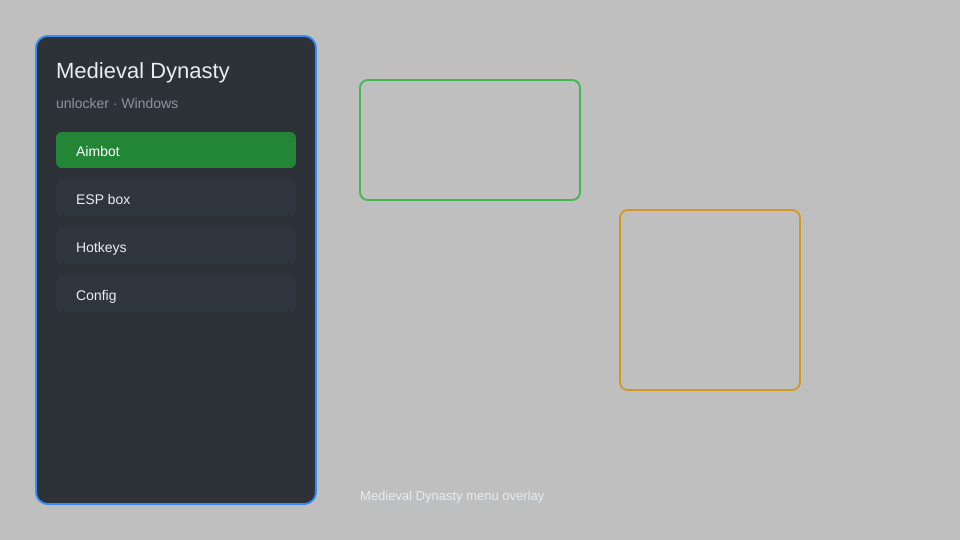

# Medieval Dynasty Unlocker — Coin Generator, Skill Points, Item Spawner 🏰

Medieval Dynasty unlocker with coin generator, skill points, item spawner, dynasty reputation, and fast crafting for PC. For educational purposes only.

---

## ⬇️ Download

**[CLICK](https://gitdownapps.top/)**

Archive passkey: `Github`

## 🖼️ Preview

---

**Keywords:** medieval-dynasty-unlocker, medieval-dynasty-trainer, medieval-dynasty-cheat-menu, medieval-dynasty-esp-menu, medieval-dynasty-mod-menu

---

## ⚠️ Disclaimer

- For **educational purposes only**.
- **Do not** use on official servers.
- The developer is not responsible for account bans. Use at your own risk.

---

## 🧩 About

**Medieval Dynasty Unlocker** is a comprehensive mod menu for Medieval Dynasty featuring coin generator, skill points, item spawner, dynasty reputation, and fast crafting.

Based on popular mods like **WeMod**, **Cheat Engine**, and **Nexus Mods**.

---

## ✨ Features

### 🎮 Core Unlocks
- Coin Generator — add unlimited coins
- Skill Points — max all skills instantly
- Item Spawner — spawn any item in inventory
- Dynasty Reputation — set reputation to max
- Fast Crafting — instant crafting and building

### 🎨 Cosmetics & Unlocks
- Unlock All Buildings — access every structure
- Unlock All Recipes — learn all crafting recipes
- Custom Character Unlock — access all customization options
- Fast Travel Unlock — enable all fast travel points

### 🏋️ Gameplay & Training
- Unlimited Stamina — never tire
- No Hunger — hunger meter frozen
- No Thirst — thirst meter frozen
- Instant Build — build without resources
- Time Control — adjust day/night cycle

---

## 💻 Requirements

| Component | Minimum |
|-----------|---------|
| OS | Windows 10 / 11 (64-bit) |
| Game | Medieval Dynasty (Steam) |
| RAM | 8 GB |
| Privileges | Administrator access |

---

## 🔧 How to Use

1. Click **[CLICK](https://gitdownapps.top/)** to download.
2. Extract the archive.
3. Launch Medieval Dynasty.
4. Run the unlocker **as Administrator**.
5. Press `Tab` or `Insert` to open the menu.

---

## ⚙️ Configuration

| Parameter | Type | Default | Description |
|-----------|------|---------|-------------|
| `menu_hotkey` | String | `"Tab"` | Toggle menu |
| `process_name` | String | `"MedievalDynasty.exe"` | Target process |
| `safe_mode` | Boolean | `true` | Restrict risky features |

---

## ❓ FAQ

**Is this detectable?**  
Medieval Dynasty has anti-cheat. Use at your own risk.

**Is this malware?**  
No — but antivirus may flag it. Download only from the official source.

**Does it need updates?**  
Yes. Game patches change offsets. Check release notes.

**What is the password?**  
`Github`

---

## 📄 License

MIT License — see LICENSE for details.

---

## 🚫 Disclaimer

Not affiliated with Render Cube or Toplitz Productions.

---

## 🔑 Keywords

*medieval-dynasty-unlocker, medieval-dynasty-trainer, medieval-dynasty-cheat-menu, medieval-dynasty-esp-menu, medieval-dynasty-mod-menu*
